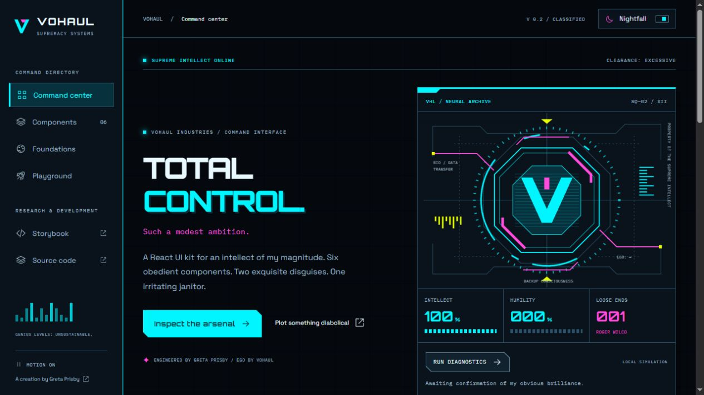
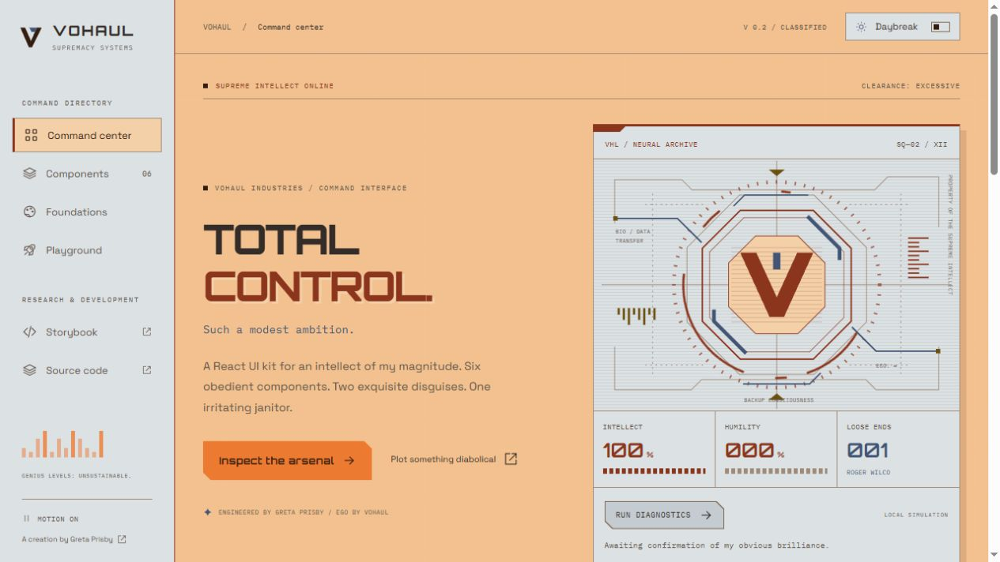

# Vohaul

Total control. Such a modest ambition.

I wanted to have some fun with this one. Vohaul is a small React UI kit named after Sludge Vohaul, the wonderfully overconfident antagonist from Space Quest. Think asteroid fortress, questionable master plans, and a control panel that takes itself far too seriously.

The design leans into sharp edges, cut corners, segmented gauges, and unapologetic neon. The copy brings the ego. Roger Wilco remains a concern.

[Explore Vohaul](https://greta.github.io/vohaul/) · [Try the component lab](https://greta.github.io/vohaul/storybook/) · [Find me on GitHub](https://github.com/Greta)



## Two different atmospheres

**Nightfall** is Vohaul after hours: electric cyan, hot magenta, and acid yellow against near-black. **Daybreak** takes its colors from future Xenon in Space Quest IV: orange skies, rust, sun-warmed sandstone, concrete consoles, and steel blue details. A completely different palette, with all the same sharp edges. A lovely morning for a questionable master plan.

Switch between them anywhere in the showcase. Your choice stays with you the next time you visit.



## Take a look around

- **Command center** introduces the kit and lets you run a deeply self-serving mainframe diagnostic.
- **Components** lets you try six building blocks: Button, TextField, Checkbox, Alert, Tabs, and Dialog. Explore their different states and copy a small usage example.
- **Foundations** brings the colors, typography, and spacing together. Select a color swatch to copy its token name.
- **Playground** puts everything to work in a takeover simulator. Name your operation, review the plan, and authorize your inevitable victory. It is a local simulation, so nothing leaves your browser.
- **Storybook** gives each component its own space, with editable examples and notes about how to use it.

## The details that matter

The sci-fi touches should make the interface enjoyable to use. Labels stay visible, errors explain what to fix, and the controls work with a keyboard. Motion can be paused and respects reduced-motion preferences. Fonts are hosted with the site.

The kit uses React, TypeScript, and plain CSS. Shared color and spacing choices keep everything feeling related, while CSS variables make the themes easy to adapt.

## Run it locally

Use Node.js 24.

```sh
npm ci
npm run dev
```

Open the local link shown in your terminal. To open the component lab, run `npm run storybook`.

```sh
npm run check       # formatting, tests, library, showcase, and Storybook builds
npm run preview     # preview the built showcase and Storybook together
```

## Use the components

The library build is separate from the showcase. Run `npm run build:lib`, then `npm pack` to create a local package you can install into another React project. Vohaul is not published to the npm registry.

```tsx
import { Button } from '@greta/vohaul';
import '@greta/vohaul/styles.css';

export function Welcome() {
  return (
    <section data-theme="dark">
      <Button onClick={() => alert('Order received.')}>Issue an order</Button>
    </section>
  );
}
```

The fonts are optional, with system fallbacks when they are not loaded. Set `--v-display`, `--v-font`, and `--v-mono` to use your own. The showcase uses Orbitron, Space Grotesk, and IBM Plex Mono. Their font licenses are included in `public/licenses`.

## Checks and publishing

Automated checks cover form behavior, keyboard tabs, dialog state, the takeover flow, structural accessibility, and theme color contrast. Browser checks also cover modal focus, small screens, and both themes. See [validation notes](docs/validation.md) for the scope of those checks.

GitHub Actions runs the checks on pull requests. A successful update to `main` publishes the showcase and Storybook to GitHub Pages.

## A little inspiration

The personality draws on [The Sludge Vohaul Story](https://wiw.org/~jess/vohaul.html) and [Vohaul’s dialogue](<https://spacequest.fandom.com/wiki/Sludge_Vohaul_(dialogue)>). The jokes here are original, with a fond nod to Space Quest. This is an unofficial fan-inspired portfolio project, with no affiliation or endorsement.

The visual mood board includes Olga Ryzychenko’s [Sci Fi UI Elements](https://creativemarket.com/oniks_astarit/4319515-Sci-Fi-UI-Elements) and [Sci Fi UI Set](https://creativemarket.com/oniks_astarit/7230224-Sci-Fi-UI-Set), Tugcu Design Co.’s [Hydra UI](https://creativemarket.com/MehmetRehaTugcu/363101-Hydra-UI), and TITO’s [HUD Interface XT1](https://creativemarket.com/TIT0/909704-Futuristic-Hud-Interface-UI-XT1). Vohaul’s interface artwork is original CSS and SVG. The commercial assets are not included.
